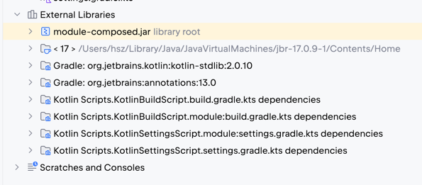

When you run the `build` Gradle task, the main module requests for a base jar from the `:module`: `module.jar` archive.

Whenever you uncomment the [`build.gradle.kts:17`](./build.gradle.kts), the `composed-jar` variant is resolved from the `:module`: `module-composed.jar` archive.

As a side effect, when you refresh the Gradle project, the `module-composed.jar` appears in the _External Libraries_ tree:

